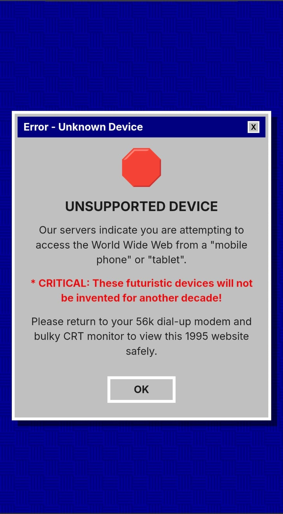
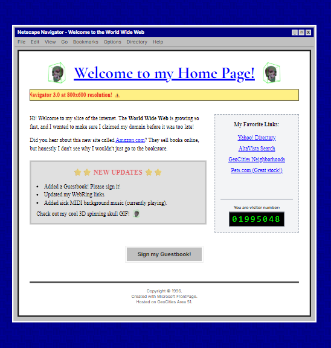

<div align="center">

# ⚡ THE FRONTEND ODYSSEY ⚡

### _A Cinematic Journey Through the Evolution of the Internet_

<br/>

```
╔══════════════════════════════════════════════╗
║   T H E   H Y P E R T E X T   H E R A L D    ║
║         ─── Est. October 29, 1969 ───        ║
╚══════════════════════════════════════════════╝
```

<br/>

[](https://nextjs.org/)
[](https://react.dev/)
[](https://typescriptlang.org/)
[](https://gsap.com/)
[](https://tailwindcss.com/)
[](https://threejs.org/)
[](https://lenis.darkroom.engineering/)

<br/>

> _"The web does not just connect machines, it connects people."_ — **Tim Berners-Lee**

---

</div>

## 🎬 The Prologue

**October 29, 1969, 10:30 PM.** A cramped lab at UCLA. A single terminal. A programmer types `L`... `O`... the system crashes. Two letters. That's all it took. The greatest invention in human history began with a spectacular failure.

**The Frontend Odyssey** is not a website. It is **an interactive time machine** — a living, breathing newspaper that unfurls before your eyes and takes you on a visceral journey through the most transformative moments in the history of the internet. From the classified Cold War labs of ARPANET, through the chaotic gold rush of the dot-com boom, to the devastating crash that almost killed it all.

Every scroll is a decade. Every animation is a turning point. Every pixel tells a story.

---

## 🌌 The Experience

### 📰 Act I (Era 1) — _"The Dawn of ARPANET"_ (1969–1989)

The page loads. A black void. A counter ticks from `0%` to `100%`. Then — like a newspaper being tossed onto a café table — a vintage broadsheet explodes into view with a cinematic 3D pop-up animation. **The Hypertext Herald** is born.

You're reading about the night Leonard Kleinrock's team sent `"LO"` across the wire. Animated SVG paths trace the growth of network nodes. Photographs shimmer with vintage scanline overlays. The **Timeline of Nodes** tracks each milestone with a parallax 3D tilt effect that follows your cursor.

> _"We typed the L, and they got the L. We typed the O, and they got the O. Then we typed the G, and the system crashed."_
> — **Leonard Kleinrock**

### ⬛ The Blackout Transition

As you scroll past **END OF VOL. 1**, the world fades to black. Dead silence. Then, in massive old-newspaper typography, two words crash onto screen with a cinematic block-reveal animation:

<div align="center">

# `1989 — THE REVOLUTION`

</div>

### 🕸️ Act II (Era 2) — _"The World Wide Web"_ (1989–1999)

Tim Berners-Lee. CERN. The NeXT Computer. The proposal that nobody asked for but everyone needed. The newspaper returns, now documenting the birth of `HTML`, `HTTP`, and the explosive `.com` gold rush.

Then the newspaper _shatters_, and you're thrown headfirst into...

### 💾 The Retro Break — _"Welcome to My Home Page!"_

The entire design language shifts. You're inside an authentic **1996 GeoCities homepage**, complete with:

- 🖱️ **Authentic Windows 98 pixelated cursors** (custom PNG files!)
- 💀 **3D spinning skull GIFs** flanking the homepage title
- 📟 A live **hit counter** that increments in real-time
- 🔵 Classic blue underlined hyperlinks (that actually work — linking to Amazon, Yahoo!, AltaVista, and the legendary Pets.com)
- ⚠️ A scrolling marquee warning you to use **Netscape Navigator 3.0**
- 📝 A **"Sign My Guestbook"** button that crashes with a Windows 95 error dialog

It's absurd. It's nostalgic. It's _perfect_.

#### 📱 Adaptive Device Experience

The Retro Break isn't just a visual gag — it's **device-aware**. Mobile and tablet users are greeted by a period-accurate Windows 95 error dialog declaring their futuristic device "unsupported," while desktop users get the full Netscape Navigator simulation.

<div align="center">
<table>
<tr>
<td align="center"><strong>📱 Mobile / Tablet</strong></td>
<td align="center"><strong>🖥️ Desktop</strong></td>
</tr>
<tr>
<td></td>
<td></td>
</tr>
<tr>
<td align="center"><em>Win95 error: "These futuristic devices<br/>will not be invented for another decade!"</em></td>
<td align="center"><em>Full Netscape Navigator homepage with<br/>hit counter, guestbook, and skull GIFs</em></td>
</tr>
</table>
</div>

### 💥 Act III (Era 3) — _"The Dot-Com Bubble Burst"_ (2000–2001)

The newspaper returns — but darker. Tilted headlines. Shattered layouts. The NASDAQ is in freefall. Pets.com is dead. But from the ashes, two names survive: **Amazon.com** and **eBay.com**. Their stories of resilience are told through chaotic, ink-stained columns.

### 👥 Act IV (Era 4) — _"The Social Web"_ (2004)

A shift in the paradigm. The static web dies, and "Web 2.0" is born. Featuring a deep blue "CopyReveal" transition, this era introduces the protagonists of the new internet: Mark Zuckerberg, the Youtube Founders, and Jack Dorsey. Complete with a magical "Daily Prophet" moving photograph effect.

### 👑 Act V (Era 5) — _"Digital Consolidation"_ (2008–2016)

The empire building begins. A cinematic red timeline traces Facebook's aggressive acquisition of Instagram and WhatsApp, and their rejection by Snapchat. Featuring an animated SVG scroll-path, floating 3D timeline nodes, and a profound question on digital monopolies.

### ⛓️ Act VI (Era 6) — _"The Decentralized Dream"_ (2009–2021)

A stark Bitcoin-orange transition brings us to Web 3.0. The Genesis Block is mined by a ghost. Ethereum powers Smart Contracts. A massive surge in NFTs, featuring bored apes and crypto punks, culminating in Facebook's shocking rebrand to Meta.

### 📉 Act VII (Era 7) — _"The Reckoning"_ (2022–2026)

History repeats itself. The blood-red ink returns as the Web 3.0 bubble bursts. Meta Reality Labs torches $64 billion. The NFT market volume collapses 97%. The Meme Coin Graveyard leaves millions with worthless digital assets.

### 🖋️ Epilogue — _"The Editor's Desk"_

At the very bottom of the broadsheet lies the Editor's Desk. A Top Secret classified document waiting to be opened. Click it to trigger a buttery-smooth physics-based 3D flip, revealing the underlying architectural manifesto and the creator behind the odyssey.

---

## 🏗️ The Architect's Blueprint

```text
📦 History-of-Web/
│
├── 📂 public/                          # Static assets served at root
│   ├── 📂 fonts/
│   │   └── OldNewspaperTypes.ttf       # 📰 Vintage newspaper typeface
│   ├── 📂 video/
│   │   ├── Meta-rebrand.mp4            # 🎥 Zuckerberg's Meta announcement
│   │   └── mark-zukerberg-giving-demo.mp4 # 🎥 Early Facebook presentation
│   └── 📂 images/                      
│       ├── time-burners-lee.png        # 🖼️ Portrait of the WWW inventor
│       ├── jeff-bezos-amazon.png       # 🖼️ The dot-com survivor: Jeff Bezos
│       └── [...26+ historical assets]  # 🏛️ Curated retro images, GIFs, and logos
│
├── 📂 src/
│   ├── 📂 app/
│   │   ├── globals.css                 # 🎨 Design tokens, custom grids, retro cursors
│   │   ├── layout.tsx                  # 🌐 Root layout with strict Open Graph SEO tags
│   │   ├── page.tsx                    # 🚪 Entry portal — orchestrating all Eras
│   │   └── icon.png                    # ✨ 1200x630 Social sharing open-graph image
│   │
│   └── 📂 components/
│       ├── 📜 PageUnfurl.tsx           # ⭐ Cinematic 3D paper pop-up and scroll zoom
│       ├── 📜 CopyReveal.tsx           # 🎬 CodeGrid-style block-reveal text animation
│       ├── 📜 Tilt3D.tsx               # 🎭 Interactive parallax hover cards with glare
│       ├── 📜 SmoothScrolling.tsx      # 🧈 Lenis-powered butter-smooth scroll wrapper
│       ├── 📜 LoadingNewspaper.tsx     # ⏳ Vintage percentage-based interactive preloader
│       │
│       └── 📂 sections/                # 📖 THE CHAPTERS OF HISTORY
│           │
│           ├── Era1_Arpanet.tsx        # 💾 Ch.1 — ARPANET, packet switching, "LO"
│           ├── Era2_WWW.tsx            # 🌐 Ch.2 — Tim Berners-Lee, HTML, dot-com boom
│           ├── RetroWeb.tsx            # 🕹️ BREAK — 1996 GeoCities homepage simulation
│           ├── Era3_BubbleBurst.tsx    # 💥 Ch.3 — NASDAQ crash, Amazon & eBay survival
│           ├── Era4_Web2.tsx           # 👥 Ch.4 — Web 2.0, Facebook, YouTube, Twitter
│           ├── Era5_SocialMedia.tsx    # 👑 Ch.5 — Monopolies, scroll-animated acquisitions
│           ├── Era6_Web3.tsx           # ⛓️ Ch.6 — Bitcoin, Ethereum, NFTs, Meta rebrand
│           ├── Era7_Web3Burst.tsx      # 📉 Ch.7 — The $64B Metaverse crash, crypto winter
│           └── TheEditorsDesk.tsx      # 🖋️ FINALE — Interactive 3D flip architectural manifesto
│
├── CLAUDE.md                           # 🧠 AI pair-programming context & guidelines
├── AGENTS.md                           # 🤖 Automated agent rules and workflows
├── postcss.config.mjs                  # ⚙️ PostCSS pipeline (required by Tailwind v4)
├── next.config.ts                      # 🏗️ Next.js 16 framework configuration
├── tsconfig.json                       # 📘 TypeScript compiler strict options
└── package.json                        # 📦 Dependencies and custom run scripts
```

---

## ⚙️ The Tech Arsenal

| Layer          | Technology                           | Purpose                                                                 |
| -------------- | ------------------------------------ | ----------------------------------------------------------------------- |
| **Framework**  | Next.js 16 (App Router)              | Server-side rendering, file-based routing                               |
| **UI**         | React 19 + TypeScript                | Component architecture with full type safety                            |
| **Styling**    | Tailwind CSS v4                      | Utility-first styling with custom design tokens                         |
| **Animations** | GSAP 3 + ScrollTrigger               | Timeline sequencing, scroll-driven reveals, 3D transforms               |
| **Scroll**     | Lenis                                | Inertia-based smooth scrolling across all browsers                      |
| **3D**         | Three.js + React Three Fiber         | WebGL-powered interactive 3D elements                                   |
| **Typography** | Google Fonts + OldNewspaperTypes TTF | Cormorant Garamond (headlines), Inter (UI), OldNewspaperTypes (vintage) |
| **SEO & Social**| Next.js Metadata API + Tags        | Fully configured Open Graph & Twitter Summary Large Image static tags for perfect link unfurling on WhatsApp, X, and iMessage |

---

## 🪄 Signature Animations

| Animation             | Component          | Description                                                                                   |
| --------------------- | ------------------ | --------------------------------------------------------------------------------------------- |
| **Unfurl**            | `PageUnfurl.tsx`   | 3-phase cinematic entry: loading counter → 3D paper pop-up → scroll-driven zoom to fullscreen |
| **Block Reveal**      | `CopyReveal.tsx`   | Colored block sweeps across text, then shrinks to reveal — inspired by CodeGrid               |
| **Interactive Flip**  | `TheEditorsDesk.tsx`| Physics-based 3D card flip using unified GSAP `expo.inOut` easing for buttery organic motion  |
| **Parallax Tilt**     | `Tilt3D.tsx`       | Mouse-tracking 3D perspective shift with optional glare overlay                               |
| **SVG Path Draw**     | `Era1_Arpanet.tsx` | Scroll-driven SVG stroke animation tracing the ARPANET node timeline                          |
| **Character Cascade** | `Era1_Arpanet.tsx` | Each letter of "THE HYPERTEXT HERALD" animates individually with rotation + spring            |
| **Hit Counter**       | `RetroWeb.tsx`     | Live-incrementing visitor counter with green-on-black terminal aesthetic                      |

---

## 🚀 Launch the Time Machine

```bash
# Clone the repository
git clone https://github.com/Priyansh9506/Frontend-Odyssey.git

# Enter the project
cd Frontend-Odyssey/History-of-Web

# Install dependencies
npm install

# Launch
npm run dev
```

Open **[http://localhost:3000](http://localhost:3000)** and let the newspaper unfurl.

---

## 🎨 The Design Philosophy

<div align="center">

### _"Breathing Soul Into The Broadsheet"_

_Before the internet, the world connected through ink and paper. We are bringing that soul back to the digital age._

</div>

Before the web, newspapers and printed articles were our primary vessels of human communication—tangible artifacts of history as it happened. **The Frontend Odyssey** takes this traditional, tactile medium and injects it with depth, movement, and soul.

By employing bleeding-edge web technology, we've made the static broadsheet feel alive:

- **Depth & Perspective:** Interactive 3D tilt cards (`Tilt3D.tsx`) blur the line between screen and paper, reacting to the reader's every move.
- **Living History:** Animated SVG timelines trace the actual growth of the network and corporate acquisitions, drawing the story as you scroll.
- **Cinematic Motion:** Videos embed seamlessly into custom "Daily Prophet" moving photographs, while headlines and paragraphs reveal themselves precisely like a storyteller pausing for breath.

It focuses less on the dry, technical facts of the web, and more on how these shifts made us _feel_. It is a love letter to the past, built entirely with the tools of the future.

---

<div align="center">

### 🕸️ Built for the [Frontend Odyssey Hackathon](https://github.com/Priyansh9506/Frontend-Odyssey) 🕸️

<br/>

_The internet began with two letters and a crash._
_This project is our love letter to every line of code that came after._

<br/>

**`L O`**

</div>
